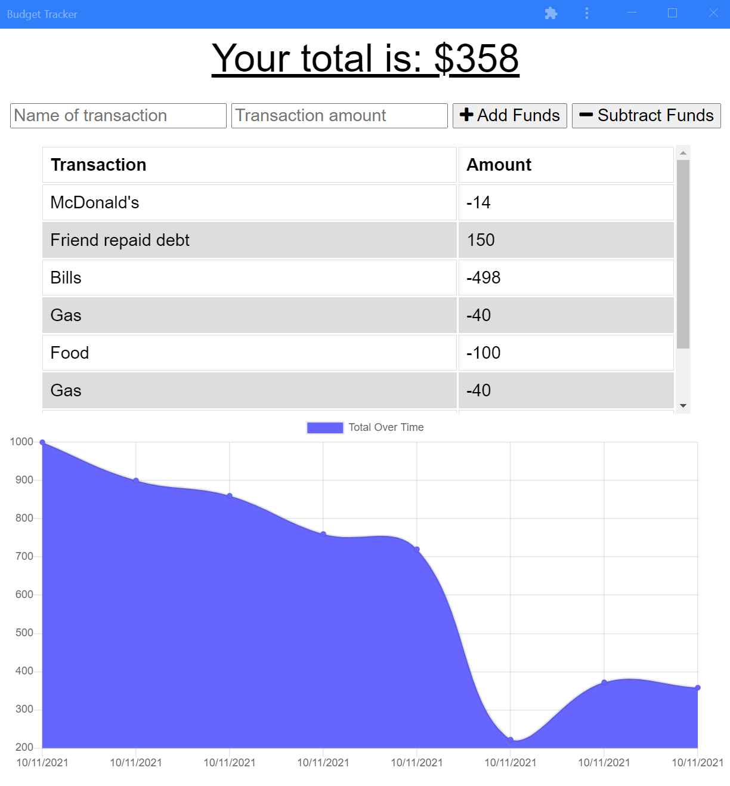

# Budget-Tracker

## Badges

## Description
A Progressive Web Application that allows a user to track their budget, even when offline.

## Table of Contents
  
- [Installation](#installation)
- [Questions](#questions)
- [License](#license)

## Installation
Visit https://intense-hollows-57380.herokuapp.com/ to demo.

## Questions
If you have any questions you can reach me at klcbusiness@hotmail.com or via [GitHub](https://github.com/kevinchewning).

## License
MIT
https://opensource.org/licenses/MIT